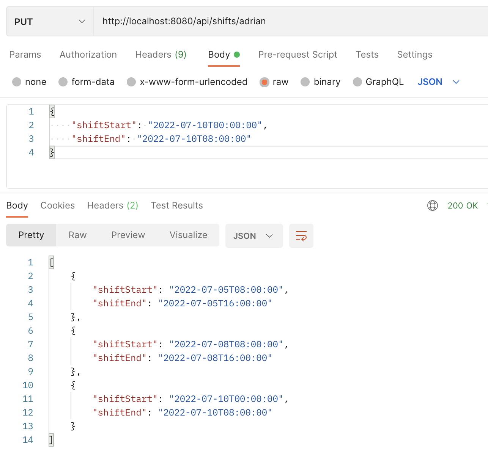
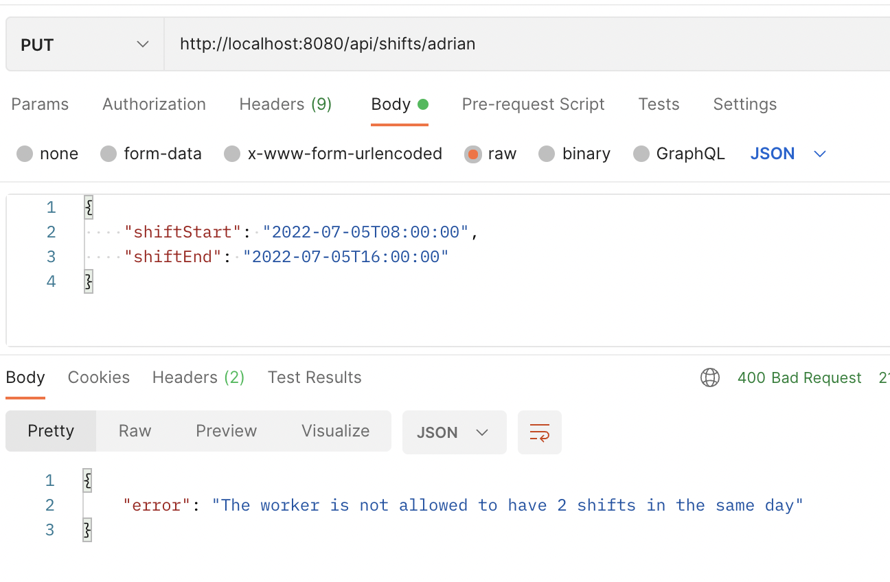

# work-shifts

Work Shifts API
---
Business requirements:

```
A worker has shifts
A shift is 8 hours long
A worker never has two shifts on the same day
It is a 24 hour timetable 0-8, 8-16, 16-24
```

- GET /api/shifts/{workerName}
---
- PUT /api/shifts/{workerName}
```
{
    "shiftStart": "2022-07-05T08:00:00",
    "shiftEnd": "2022-07-05T16:00:00"
}
```


## Technical: 

- Spring WebFlux
- Hexagonal Architecture


Demo:

---

